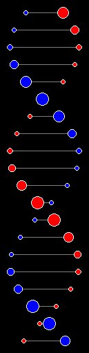



## Rotating DNA Strand

### Description

This is something I made in QB a few years back that I finally got around to porting to VB... Basically, it simulates a rotating strand of DNA... You could probably use it to add graphics to something...
 
### More Info
 
None required, but you can change many options: Bar Length, Number of Bars, Colors of Both Molecules, How far the molecules move, etc.

This is also a good example of how to use UDTs (User-Defined Types) for someone wanting to learn.

Nada...

             |
---                |---
**Submitted On**   |2000-08-18 17:31:28
**By**             |[Teycho](https://github.com/Planet-Source-Code/PSCIndex/blob/master/ByAuthor/teycho.md)
**Level**          |Beginner
**User Rating**    |4.9 (69 globes from 14 users)
**Compatibility**  |VB 5\.0, VB 6\.0
**Category**       |[Graphics](https://github.com/Planet-Source-Code/PSCIndex/blob/master/ByCategory/graphics__1-46.md)
**World**          |[Visual Basic](https://github.com/Planet-Source-Code/PSCIndex/blob/master/ByWorld/visual-basic.md)
**Archive File**   |[CODE\_UPLOAD91008182000\.zip](https://github.com/Planet-Source-Code/teycho-rotating-dna-strand__1-10801/archive/master.zip)

